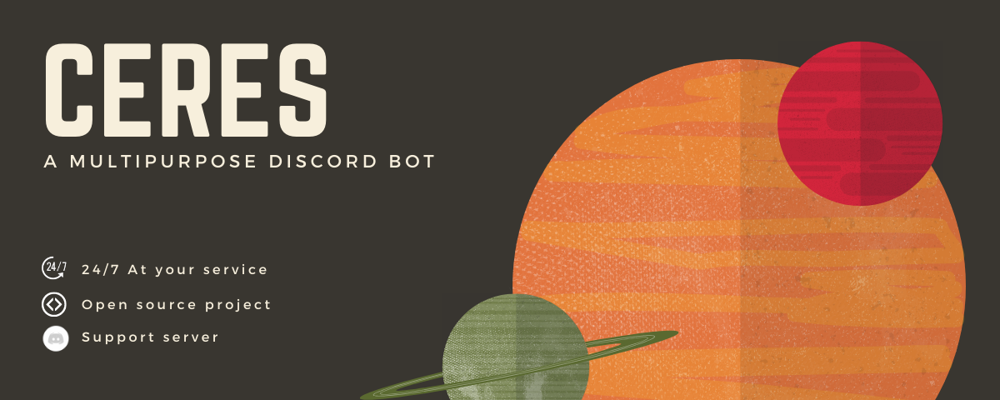

# Ceres 🌊

<div align="center">

  <br> <br>

[](https://github.com/gamingboots/Ceres)
[](https://python.org)
[](https://github.com/gamingboots/Ceres)
[](https://gamingboots/Ceres)
[](https://github.com/gamingboots/Ceres)
[](https://discord.gg/ATzc2XQNnM)
</div>
<div align = "center"><strong> Ceres is made with ❤ by <u>gamingboots</u> </strong></div>
<hr>

<strong>
</strong>

</div>
<div>
<p> 
🔥 Ceres is a discord bot written in Python and uses Py-cord library, and is totally based on application commands and supports all the new discord features!<br>
</div>
<hr>
<div align = "center">
<h3>Edit this code and help me make it better!</h3>

[](https://gamingboots/Ceres)
[](https://glitch.com/edit/#!/import/github/gamingboots/Ceres)
[](https://code.visualstudio.com/)
[](https://www.sublimetext.com/)
</div>
<hr><br>
<h3>Tools</h3>

> - &nbsp;
> - &nbsp;
> - &nbsp;

<hr>
<br>

## 📋 Features
<hr>
⚡️ Open-Source
<br>
⚡️ Contains Cogs for Easy Management of Code
<br>
⚡ Open to Contributions
<br>
⚡ Actively Maintained
<br>
⚡ Contains Constant New Features of Discord
<br>
⚡️ Easy to modify
<br>
⚡️ Easy to use and user friendly
<br>
⚡️ Properly commented out code for user comfort

## 🚀 Contributing 

### Step 1: Clone The Repo 💡

Fork the repository and then clone it locally by doing -

```bash
git clone https://github.com/gamingboots/Ceres.git
```

### Step 2: Build Your Code 🔨

Start your magic by modifying the code and making changes of your own. Then push the commit using -

```bash
git add .
git commit -m "your commit message"
git push YOUR_REPO_URL develop
```

### Step 3: Create a new pull request 🔃

After cloning & setting up the local project you can push the changes to your github fork and make a pull request.

<hr>

## ✨ Contributors

Contributions are always welcomed :D

<a href="https://github.com/gamingboots/Ceres/graphs/contributors">
  
</a>
